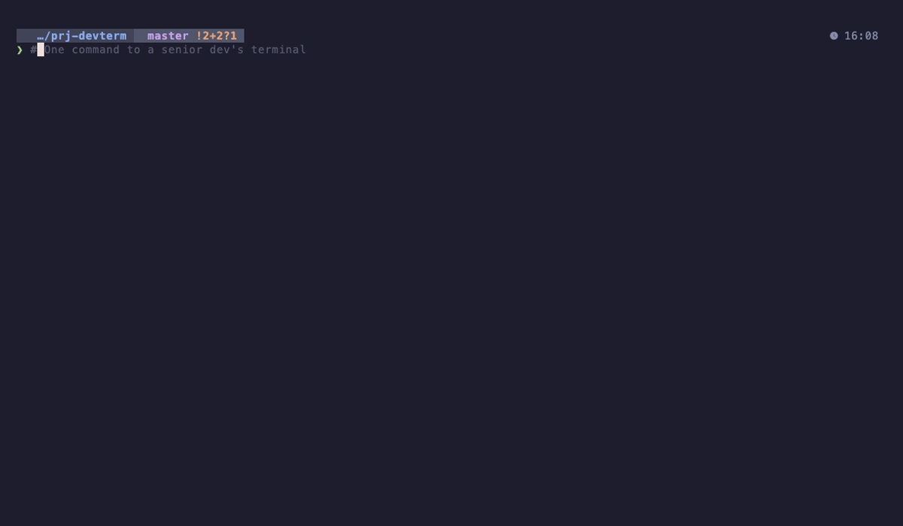

# devterm

> One command to the terminal setup senior devs spend days configuring.

[](LICENSE)
[](https://www.apple.com/macos/)
[](https://www.linux.org/)
[](https://www.zsh.org/)
[](https://catppuccin.com/)
[](https://starship.rs/)
[](https://github.com/c0x12c/devterm-kit/actions)

<p align="center">
  
</p>

---

```bash
curl -fsSL https://raw.githubusercontent.com/c0x12c/devterm-kit/main/install.sh | bash
```

---

## What is devterm?

**devterm** automates the terminal setup that every experienced developer uses — but takes hours to configure manually. Run one command on a fresh machine and get a beautiful, productive terminal in under 2 minutes.

Works on **macOS** (Homebrew) and **Linux** (apt / pacman / dnf).

**Stack:** [Starship](https://starship.rs) · [Catppuccin](https://catppuccin.com) · [Oh My Zsh](https://ohmyz.sh) · [MesloLGS NF](https://github.com/romkatv/powerlevel10k#fonts)

---

## Quick Start

**One-liner (recommended):**
```bash
curl -fsSL https://raw.githubusercontent.com/c0x12c/devterm-kit/main/install.sh | bash
```

**Or clone and run:**
```bash
git clone https://github.com/c0x12c/devterm-kit.git
cd devterm
chmod +x setup.sh
./setup.sh
```

**Pick a theme upfront:**
```bash
./setup.sh --theme macchiato   # or: mocha (default), frappe, latte
```

---

## What Gets Installed

| Component | Purpose | Skip if present |
|-----------|---------|----------------|
| **MesloLGS NF** | Nerd Font with icons for the prompt | ✓ |
| **Zsh** | Best shell for developers | ✓ |
| **Oh My Zsh** | Plugin manager + completions framework | ✓ |
| **Starship** | Fast, cross-shell prompt with git & lang info | ✓ |
| **zsh-autosuggestions** | Fish-like suggestions as you type | ✓ |
| **zsh-syntax-highlighting** | Real-time command syntax coloring | ✓ |
| **Catppuccin** (iTerm2/terminal) | Easy-on-the-eyes color scheme | new file |
| **fzf** | Fuzzy history search (Ctrl+R) | ✓ |
| **eza** | Modern `ls` with icons & git status | ✓ |
| **bat** | `cat` with syntax highlighting | ✓ |
| **zoxide** | Smarter `cd` that learns your habits | ✓ |

**Safe to re-run** — every step checks if already installed and skips it.

---

## Themes

Choose from all 4 Catppuccin variants. Pick interactively or pass a flag:

| Variant | Style | Flag |
|---------|-------|------|
| **Mocha** | Dark (default) | `--theme mocha` |
| **Macchiato** | Dark, slightly warmer | `--theme macchiato` |
| **Frappé** | Medium dark | `--theme frappe` |
| **Latte** | Light | `--theme latte` |

The selected flavor is applied to both the Starship prompt config and the iTerm2 color scheme.

---

## Options

```
./setup.sh [OPTIONS]

  --theme <variant>    Catppuccin variant: mocha (default), latte, frappe, macchiato
  --minimal            Skip CLI tools (fzf, eza, bat, zoxide)
  --non-interactive    No prompts, use defaults
  --doctor             Check your devterm setup for issues
  -h, --help           Show help
  -v, --version        Show version
```

---

## After Installation

**macOS (iTerm2):**

1. Set the font:
   ```
   iTerm2 → Preferences (⌘,) → Profiles → Text → Font: "MesloLGS NF"  Size: 14
   ```

2. Apply the color scheme:
   ```
   iTerm2 → Preferences → Profiles → Colors → Color Presets → catppuccin-mocha
   ```

3. Quit and reopen iTerm2 (Cmd+Q — not just close the window)

**Linux:**

The Starship prompt is active immediately. For the color theme, visit [catppuccin.com](https://github.com/catppuccin) and find your terminal emulator (Alacritty, Kitty, GNOME Terminal, etc.).

---

## Generated `.zshrc` Highlights

devterm generates an optimized `~/.zshrc` with these aliases pre-configured:

```bash
# Navigation (eza replaces ls)
ls          # eza with icons
ll          # long list with git status
lt          # tree view (2 levels)

# Git shortcuts
gs          # git status
ga          # git add
gcm "msg"   # git commit -m
gp          # git push
gl          # pretty git log graph

# Gradle (Spartan stack)
gwb         # ./gradlew build
gwt         # ./gradlew test

# Smart navigation
j <name>    # jump to frequent directory (zoxide)
..          # cd ..
...         # cd ../..

# Reload config
reload      # source ~/.zshrc
```

Your existing `~/.zshrc` is backed up to `~/.zshrc.backup.YYYYMMDD_HHMMSS` before any changes.

---

## Doctor Command

Run `./setup.sh --doctor` to verify your setup is working correctly:

```
devterm doctor — checking your setup

  ✓ Starship installed (starship 1.18.0)
  ✓ ~/.config/starship.toml exists
  ✓ Oh My Zsh installed
  ✓ MesloLGS NF fonts (4/4 variants)
  ✓ zsh-autosuggestions
  ✓ zsh-syntax-highlighting
  ✓ eza, bat, fzf, zoxide

Platform: macOS 14.0 (arm64)
All checks passed.
```

---

## Requirements

**macOS:**
- macOS 12 (Monterey) or later
- iTerm2 ([download](https://iterm2.com))
- Internet connection (for downloading components)
- Homebrew (auto-installed if missing)

**Linux:**
- Ubuntu 20.04+ / Arch / Fedora (or any apt / pacman / dnf distro)
- Internet connection
- `curl` and `git` pre-installed

---

## Uninstall

devterm doesn't install a daemon or background process. To revert:

```bash
# Restore your previous .zshrc
cp ~/.zshrc.backup.* ~/.zshrc   # use the most recent backup

# Remove installed components (optional)
brew uninstall fzf eza bat zoxide starship   # macOS
# or: apt remove / pacman -R / dnf remove    # Linux

# Remove Oh My Zsh
uninstall_oh_my_zsh

# Remove devterm itself
rm -rf ~/.devterm
```

---

## Contributing

Contributions are welcome! See [CONTRIBUTING.md](CONTRIBUTING.md).

Good places to start:

- [ ] Add [Ghostty](https://ghostty.org) terminal color scheme support
- [ ] Add [WezTerm](https://wezfurlong.org/wezterm/) config generation
- [ ] Add `--update` flag to pull latest devterm changes
- [ ] Fish shell support
- [ ] Windows WSL2 support

Run the test suite locally:
```bash
brew install bats-core   # macOS
bats tests/
```

---

## Credits

devterm is a curated automation layer on top of excellent open-source projects:

- [Starship](https://starship.rs) — the prompt
- [Catppuccin](https://catppuccin.com) — the color scheme
- [Oh My Zsh](https://ohmyz.sh) — the framework
- [MesloLGS NF](https://github.com/romkatv/powerlevel10k#fonts) — the font
- [eza](https://github.com/eza-community/eza), [bat](https://github.com/sharkdp/bat), [fzf](https://github.com/junegunn/fzf), [zoxide](https://github.com/ajeetdsouza/zoxide) — the tools

---

## License

MIT — see [LICENSE](LICENSE).
